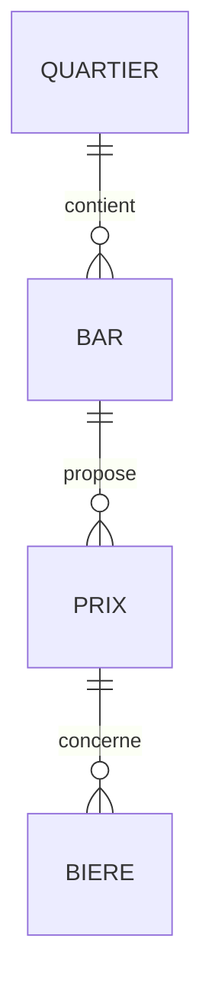

# MCD — Carte des bars à Dijon

## 1. Entités et attributs

### Quartier
- id_quartier (PK)
- nom

### Bar
- id_bar (PK)
- nom
- adresse
- id_quartier (FK vers Quartier)

### Bière
- id_prix
- nom
- type
- degre

### Prix
- id_prix (PK)
- id_bar (FK vers Bar)
- prix

## 2. Relations

- **Quartier → Bar** : 1 quartier contient plusieurs bars (1:N)
- **Bar → Prix → Bière** : un bar propose plusieurs bières et une bière peut être vendue dans plusieurs bars (N:M) via Prix

## 3. Diagramme Mermaid

