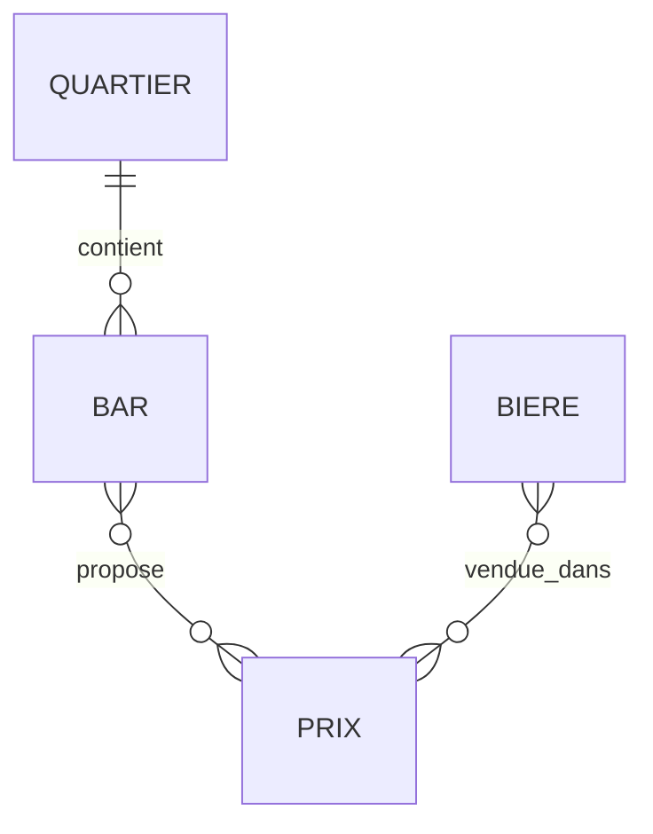

# MCD - Carte des bars à Dijon

## Description fonctionnelle
Gérer localisation bars, bières disponibles et prix par bar.

## Entités & Attributs

### QUARTIER
- **id_quartier (PK)**
- nom

### BAR
- **id_bar (PK)**
- nom
- adresse
- *id_quartier (FK)*

### BIERE
- **id_biere (PK)**
- nom
- type
- degre

### PRIX (Association N:M) 
- prix
- *id_bar (FK)*
- *id_biere (FK)*

## Relations
QUARTIER (1,N) BAR : **contient**
BAR (N,M) BIERE : **propose** (via PRIX)

## Diagramme Mermaid

